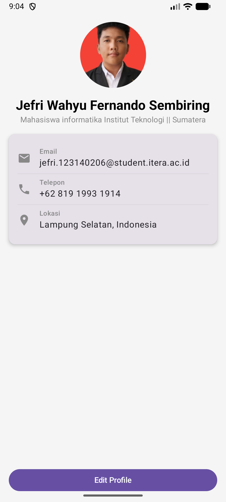

# Tugas 3 - My Profile App 📱

Aplikasi profil diri sederhana yang dibangun menggunakan **Kotlin Multiplatform (KMP)** dan **Compose Multiplatform**. Proyek ini dibuat untuk memenuhi tugas praktikum minggu ke-3 mata kuliah Pemrograman Mobile.

## 👤 Informasi Mahasiswa
* **Nama:** Jefri Wahyu Fernando Sembiring
* **NIM:** 123140206
* **Program Studi:** Teknik Informatika
* **Instansi:** Institut Teknologi Sumatera (ITERA)

---

## 🚀 Fitur Aplikasi
Sesuai dengan instruksi tugas, aplikasi ini mencakup:

1.  **Halaman Profil:**
    * **Header:** Foto profil berbentuk lingkaran (*circular*) dengan nama lengkap.
    * **Bio:** Deskripsi singkat sebagai mahasiswa Informatika.
    * **Informasi Kontak:** Daftar informasi yang terdiri dari Email, Nomor Telepon, dan Lokasi.
2.  **Komponen Reusable (Minimal 3):**
    * `ProfileHeader`: Komponen untuk bagian atas profil.
    * `InfoItem`: Komponen baris informasi yang dapat digunakan berulang kali.
    * `ProfileCard`: Wadah kartu untuk mengelompokkan informasi.
3.  **UI Layouting:**
    * Implementasi menggunakan `Column`, `Row`, `Box`, `Card`, `Text`, `Button` (dimana memiliki aksi onclick dimana hasil
    testnya dapat di lihat di logcat), dan `Image/Icon`.


---

## 📸 Screenshot Aplikasi
Berikut adalah tampilan aplikasi saat dijalankan di Android :



---

## 🛠️ Teknologi yang Digunakan
* **Language:** Kotlin
* **UI Framework:** Compose Multiplatform
* **Development Tool:** Android Studio 
* **Directory Name:** `Tugas3`

---

## 📂 Struktur Direktori Utama
```text
Tugas3/
├── composeApp/
│   └── src/
│       └── commonMain/
│           ├── composeResources/drawable/ (Tempat foto profil)
│           └── kotlin/com/example/tugas3/
│               ├── App.kt (Halaman Utama)
│               ├── ProfileHeader.kt
│               ├── ProfileCard.kt
│               └── InfoItem.kt
└── README.md