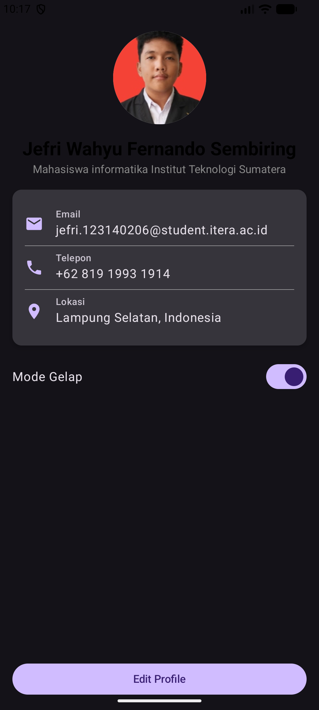
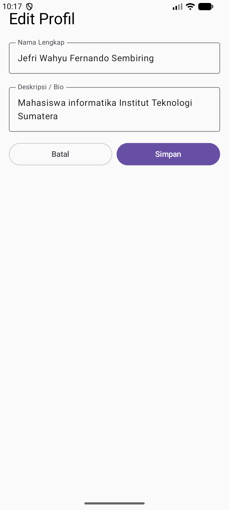

# Tugas 4 - Pemrograman Perangkat Bergerak (Navigasi & State)

**Identitas Mahasiswa**
- **Nama:** Jefri Wahyu Fernando Sembiring
- **NIM:** 123140206
- **Link Repo:** [Masukkan Link Repo GitHub Anda di Sini]

## Deskripsi Tugas
Mengembangkan aplikasi profil statis (Tugas 3) menjadi aplikasi dinamis yang mendukung navigasi antar halaman, manajemen status (State), serta fitur tambahan mode tampilan.

## Fitur Aplikasi
1. **Navigasi Dinamis**: Berpindah dari halaman profil utama ke halaman edit profil menggunakan `NavHost` dan `NavController`.
2. **State Management**:
    - Sinkronisasi data antara form edit dan tampilan utama.
    - Menggunakan `rememberSaveable` untuk menjaga data agar tidak hilang saat rotasi layar atau pergantian tema.
3. **Dark Mode Toggle**: Fitur untuk mengganti skema warna aplikasi secara instan dari Light ke Dark menggunakan Material 3 `ColorScheme`.
4. **Clean UI**: Layout modular menggunakan komponen yang dapat digunakan kembali (`ProfileCard`, `InfoItem`).

## Struktur Kode
- `App.kt`: Mengelola navigasi dan state global (Name, Bio, Theme).
- `EditProfileScreen.kt`: Form input dengan state lokal sementara sebelum disimpan.
- `InfoItem.kt`, `ProfileCard.kt`, `ProfileHeader.kt`: Komponen penyusun antarmuka profil.

## Screenshot

## Teknologi
- Kotlin Multiplatform
- Compose Multiplatform
- Jetpack Navigation Compose
- Material Design 3