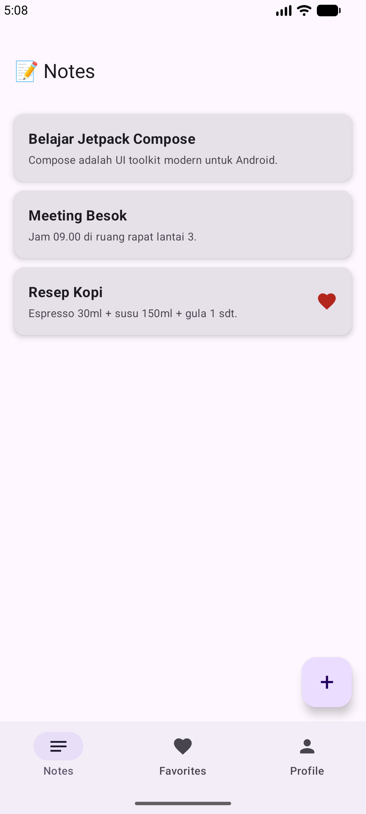
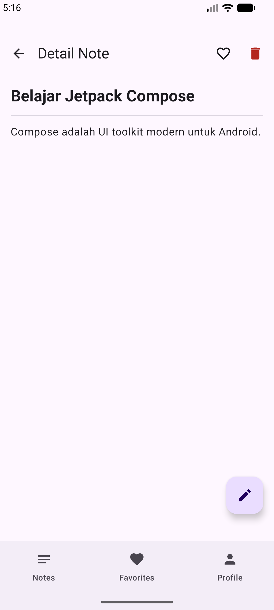
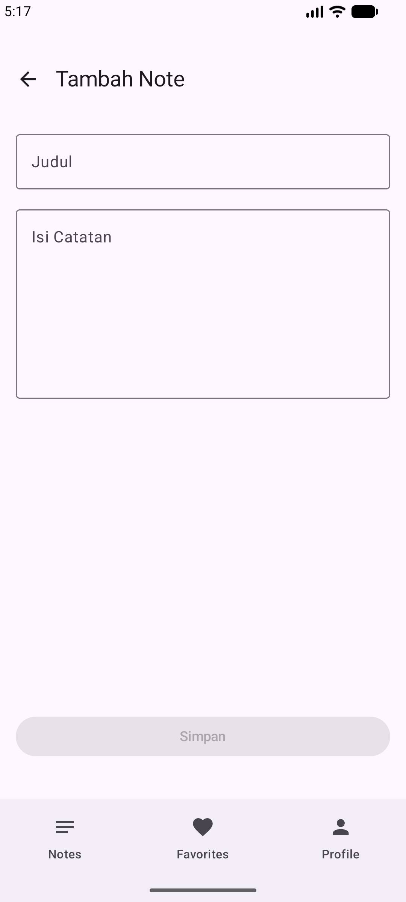
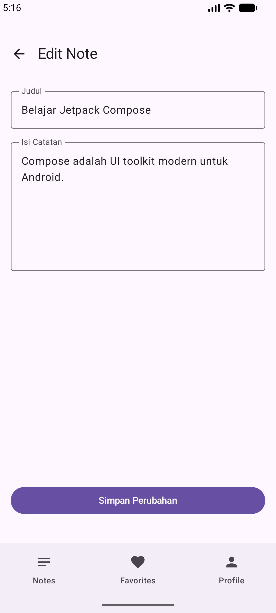
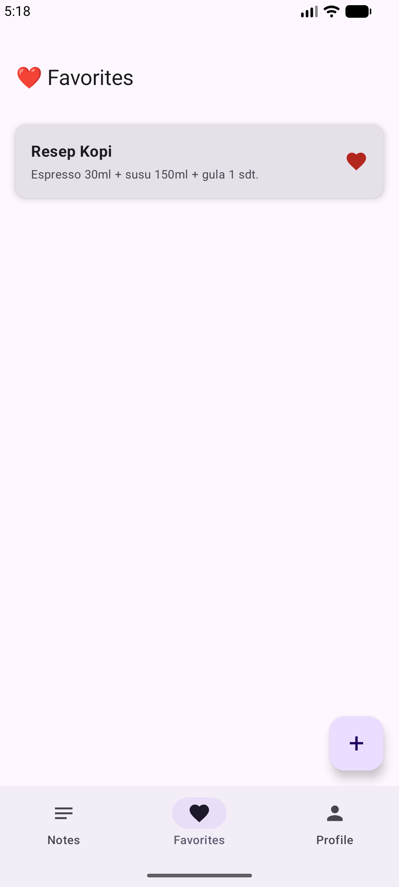
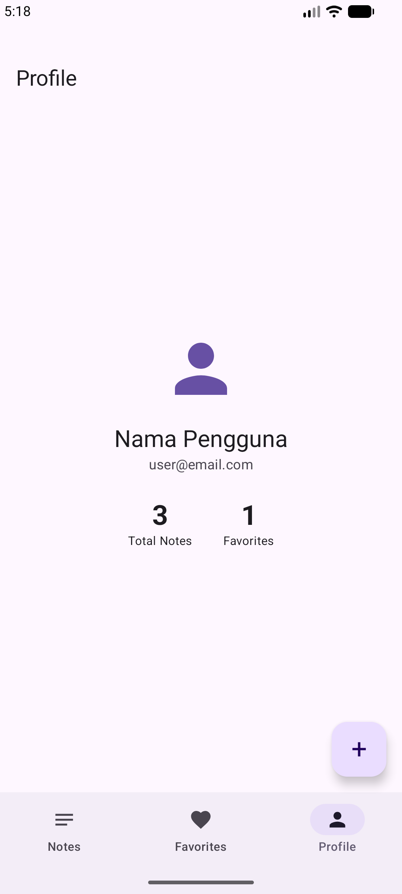

# Tugas 5 - Navigasi Antar Layar

---

## Deskripsi

Mengembangkan Notes App dari minggu lalu dengan fitur navigasi lengkap:

1. Bottom Navigation dengan 3 tabs: Notes, Favorites, Profile
2. Note List → Note Detail navigation dengan passing `noteId`
3. Floating Action Button untuk Add Note (navigate ke AddNoteScreen)
4. Back navigation yang proper dari semua screens
5. Edit Note screen dengan passing `noteId` sebagai argument

---

## 📁 Struktur File

```
composeApp/src/commonMain/kotlin/com/example/tugas5/
│
├── Screen.kt             # Sealed class untuk semua routes navigasi
├── BottomNavigation.kt   # Bottom Navigation Bar component
├── NoteModel.kt          # Data model Note & NoteRepository
└── MainScreen.kt         # Semua screen composable
    ├── MainScreen()
    ├── NotesScreen()
    ├── FavoritesScreen()
    ├── NoteCard()
    ├── DetailScreen()
    ├── AddNoteScreen()
    ├── EditNoteScreen()
    └── ProfileScreen()
```

---


## 🗺️ Routes

| Screen | Route | Argument |
|---|---|---|
| Notes (Tab) | `notes` | - |
| Favorites (Tab) | `favorites` | - |
| Profile (Tab) | `profile` | - |
| Detail Note | `detail/{noteId}` | `noteId: Int` |
| Add Note | `add_note` | - |
| Edit Note | `edit/{noteId}` | `noteId: Int` |

---

## ✨ Fitur

### 1. Bottom Navigation
Terdapat 3 tab navigasi pada bagian bawah aplikasi: **Notes**, **Favorites**, dan **Profile**, yang memudahkan pengguna berpindah antar layar utama.

### 2. Note List → Note Detail (passing noteId)
Setiap note di daftar dapat diklik untuk membuka halaman detail. `noteId` dikirim sebagai argument navigasi menggunakan:
```kotlin
composable(
    route = Screen.Detail.route,
    arguments = listOf(navArgument("noteId") { type = NavType.IntType })
) { backStackEntry ->
    val noteId = backStackEntry.arguments?.getInt("noteId") ?: 0
    DetailScreen(noteId = noteId, ...)
}
```

### 3. Floating Action Button (Add Note)
FAB `+` muncul di halaman Notes, Favorites, dan Profile untuk navigasi ke `AddNoteScreen`. FAB otomatis disembunyikan di halaman Detail, Add, dan Edit.

### 4. Back Navigation
Semua screen memiliki tombol kembali `←` di TopAppBar yang memanggil `navController.popBackStack()`.

### 5. Edit Note (passing noteId)
Dari halaman Detail, pengguna dapat menekan FAB ✏️ untuk navigasi ke `EditNoteScreen` dengan `noteId` sebagai argument, sehingga form langsung terisi data catatan yang ada.

### 6. CRUD Operations
| Operasi | Keterangan |
|---|---|
| **Create** | Tambah catatan baru via FAB `+` → AddNoteScreen |
| **Read** | Lihat daftar catatan di NotesScreen, detail di DetailScreen |
| **Update** | Edit catatan via FAB ✏️ → EditNoteScreen |
| **Delete** | Hapus catatan via tombol 🗑️ di DetailScreen |

### 7. Favorites
Catatan dapat ditandai sebagai favorit ❤️ dari halaman Detail. Halaman Favorites menampilkan hanya catatan yang difavoritkan.

---

## 📸 Screenshot


| Notes Screen | Detail Screen |
|---|---|
|  |  |

| Add Note Screen | Edit Note Screen |
|---|---|
| ! | |

| Favorites Screen | Profile Screen |
|---|---|
|  | !) |

---

## 🎥 Video Demo

> *Tambahkan link video demo 30 detik di sini*

---

## 🛠️ Teknologi

| Teknologi | Keterangan |
|---|---|
| Kotlin Multiplatform | Framework utama |
| Compose Multiplatform | UI toolkit |
| Navigation Compose KMP | `org.jetbrains.androidx.navigation:navigation-compose:2.9.2` |
| Material Icons Extended | Icon pack |


---

## 📦 Dependencies

```kotlin
commonMain.dependencies {
    implementation(libs.compose.runtime)
    implementation(libs.compose.foundation)
    implementation(libs.compose.material3)
    implementation(libs.compose.ui)
    implementation(libs.androidx.lifecycle.viewmodelCompose)
    implementation(libs.androidx.lifecycle.runtimeCompose)
    implementation("org.jetbrains.androidx.navigation:navigation-compose:2.9.2")
    implementation(compose.materialIconsExtended)
}
```