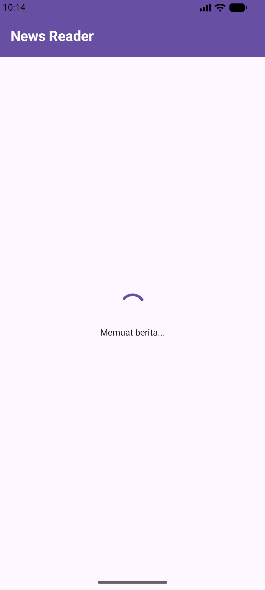
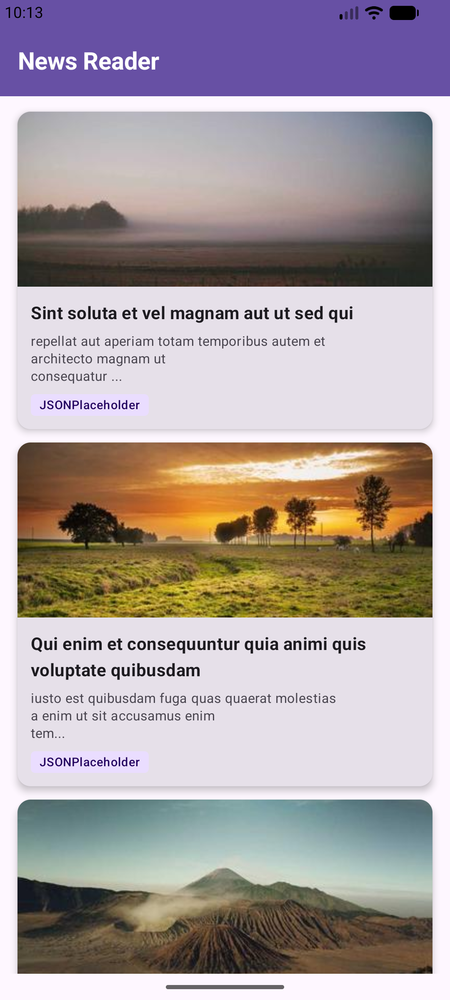
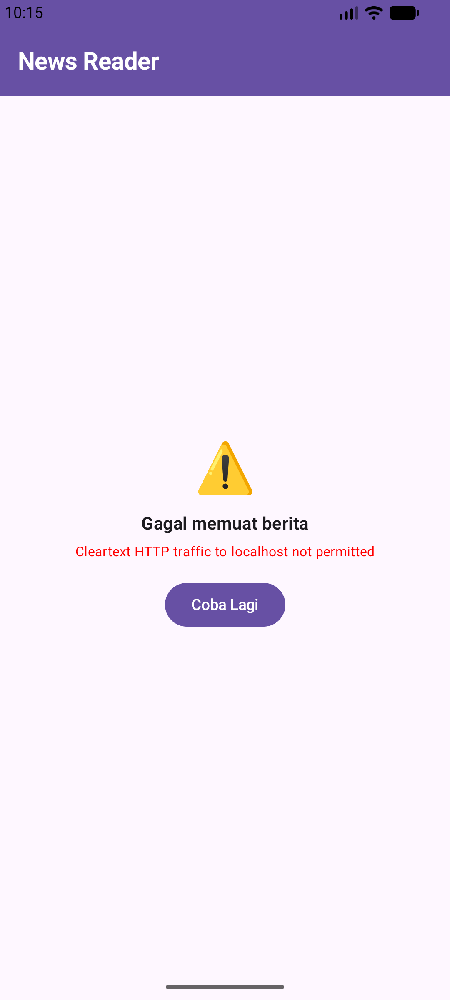
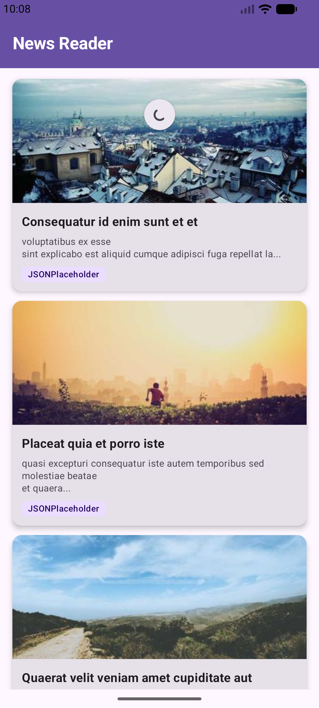

# Networking And Rest API

Aplikasi android yang menampilkan daftar artikel
dari public API atau API gratis.

## Fitur Utama
1. Fetch Data dari Public API
    - Menggunakan JSONPlaceholder API
    - Endpoint : /posts

2. List Artikel
   - Menampilkan : 
     - Judul
     - Deskripsi singkat
     - Gambar

3. Detail Artikel
   - Menampilkan :
     - Gambar
     - Judul
     - Isi Artikel

4. State Management
   - Loading state
   - Success state
   - Error State
   - Refresh State

5. Repository Pattern
   - Pemisahan Logic API dan UI

## API yang digunakan
- JSONPlaceholder API

  https://jsonplaceholder.typicode.com/posts

## Screenshot
1. Loading State

State yang terjadi saat aplikasi sedang memuat data dari API.

2. Success State

State yang terjadi saat aplikasi berhasil menampilkan data dari API

3. Error State

State yang terjadi saat aplikasi gagal menghasilkan data dari API

4. Refresh State

State yang terjadi saat aplikasi sedang melakukan refresh data dari API. 
Dengan cara pull to refresh.

## Demo Video

Link : https://drive.google.com/file/d/1uA5fxQ0WUbd2vR2ATpP9IIbMR8dhO7m5/view?usp=sharing