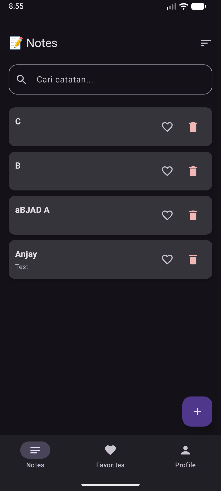
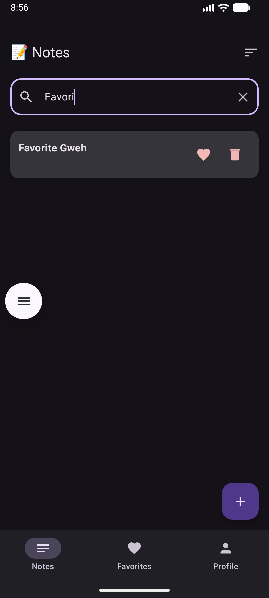
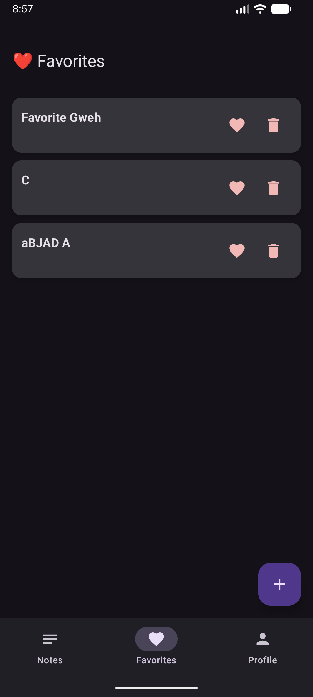
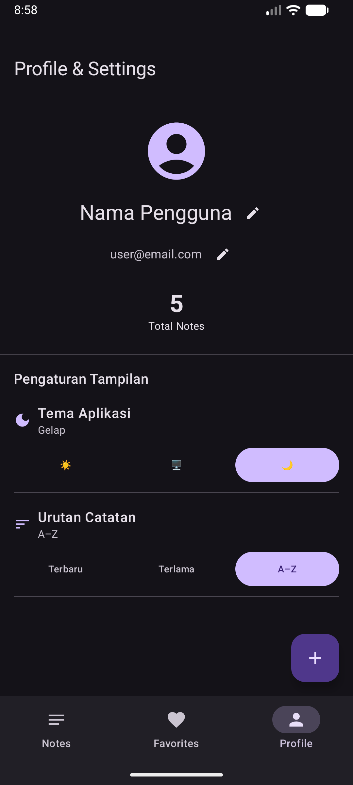

# 📝 Notes App – Tugas 7: Local Data Storage
---

## 🎯 Fitur yang Diimplementasikan

| Fitur | Status | Keterangan |
|---|---|---|
| SQLDelight Database | ✅ | CRUD notes tersimpan permanen di SQLite |
| CRUD Operations | ✅ | Create, Read, Update, Delete notes |
| Search | ✅ | Cari notes berdasarkan judul / isi |
| Sort Order | ✅ | Terbaru / Terlama / A–Z |
| DataStore (Settings) | ✅ | Tema & sort order disimpan via multiplatform-settings |
| Offline-first | ✅ | Data lokal sebagai sumber utama (tidak perlu internet) |
| UI States | ✅ | Loading, Empty, Success state |
| Favorites | ✅ | Toggle favorit, layar khusus favorit |
| Tema (Light/Dark/System) | ✅ | Diterapkan ke MaterialTheme |
| Profile editable | ✅ | Nama & email disimpan di settings |

---

## 🗄️ Database Schema

```sql
CREATE TABLE NoteEntity (
    id          INTEGER PRIMARY KEY AUTOINCREMENT,
    title       TEXT    NOT NULL,
    content     TEXT    NOT NULL,
    isFavorite  INTEGER NOT NULL DEFAULT 0,  -- 0 = false, 1 = true
    createdAt   INTEGER NOT NULL,            -- epoch milliseconds
    updatedAt   INTEGER NOT NULL             -- epoch milliseconds
);
```

### SQL Queries (Note.sq)

| Query | Deskripsi |
|---|---|
| `selectAll` | Semua notes, urut `updatedAt DESC` |
| `selectFavorites` | Notes favorit saja |
| `selectById` | Satu note berdasarkan ID |
| `search` | Cari di title ATAU content (LIKE) |
| `insert` | Tambah note baru |
| `update` | Ubah title, content, updatedAt |
| `toggleFavorite` | Flip isFavorite (0→1, 1→0) |
| `delete` | Hapus berdasarkan ID |
| `countAll` | Hitung total notes |
| `countFavorites` | Hitung total favorit |

---

## ⚙️ Settings (multiplatform-settings)

| Key | Tipe | Default | Deskripsi |
|---|---|---|---|
| `app_theme` | String | `"system"` | Tema: light / dark / system |
| `sort_order` | String | `"newest"` | Urutan: newest / oldest / az |
| `user_name` | String | `"Nama Pengguna"` | Nama profil |
| `user_email` | String | `"user@email.com"` | Email profil |

---

## 🏗️ Arsitektur

```
UI Layer (Composable Screens)
    ↕ StateFlow / collectAsStateWithLifecycle
ViewModel Layer (NotesViewModel, FavoritesViewModel, SettingsViewModel)
    ↕ Flow / suspend functions
Repository Layer (NoteRepository)
    ↕
Data Sources:
    - SQLDelight (NoteEntity) → notes.db
    - multiplatform-settings  → SharedPreferences (Android) / NSUserDefaults (iOS)
```

### Pattern yang Diterapkan
- **Single Source of Truth**: Database SQLDelight sebagai sumber utama data UI
- **Reactive Updates**: Flow → StateFlow → collectAsStateWithLifecycle
- **Repository Pattern**: Abstraksi antara data source dan ViewModel
- **Offline-first**: Semua data tersimpan lokal, siap dipakai tanpa internet

---

## 📦 Dependencies Baru (vs Tugas 5)

```toml
# SQLDelight 2.0.2
sqldelight-runtime
sqldelight-coroutines
sqldelight-android    # driver Android
sqldelight-native     # driver iOS

# multiplatform-settings 1.2.0
multiplatform-settings
multiplatform-settings-coroutines

# kotlinx-datetime 0.6.0
kotlinx-datetime
```

---

## 📱 Screenshots

> _(Tambahkan screenshot setelah menjalankan app di emulator)_

| Notes List | Search | Favorites | Settings |
|---|---|---|---|
|  |  | |  |

---

## 🎥 Video Demo

> _(Link video 45 detik menunjukkan: CRUD, search, settings, dan offline mode)_

---

