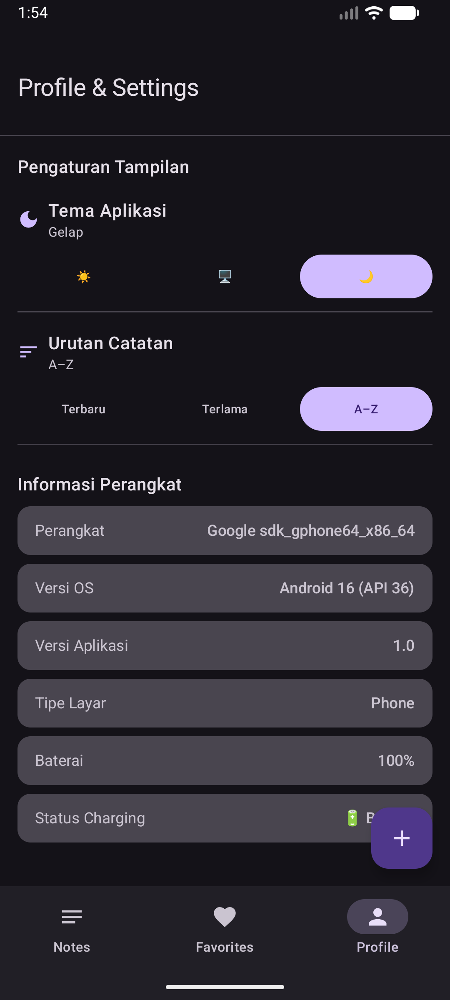
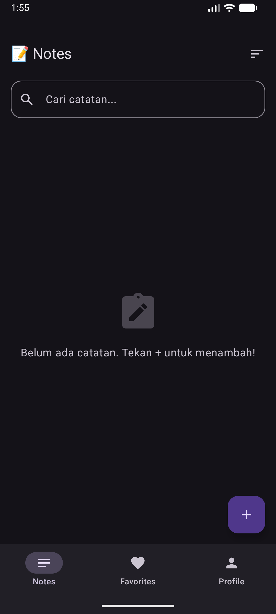
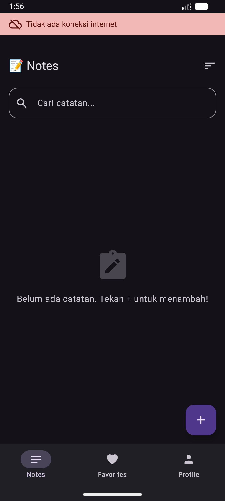

# 📝 Notes App — Tugas 8: Platform-Specific Features


---

## 🏗️ Architecture Diagram

```
┌─────────────────────────────────────────────────────────────────┐
│                         UI LAYER  (commonMain)                  │
│  ┌──────────────┐   ┌───────────────┐   ┌────────────────────┐  │
│  │ NotesScreen  │   │ ProfileScreen │   │ NetworkIndicator   │  │
│  │ list · search│   │ device info   │   │ banner offline     │  │
│  └──────────────┘   └───────────────┘   └────────────────────┘  │
│              koinViewModel()  ·  koinInject()                   │
└──────────────────────────┬──────────────────────────────────────┘
                           │ StateFlow / collectAsState
┌──────────────────────────▼──────────────────────────────────────┐
│                    VIEWMODEL LAYER  (commonMain)                 │
│  NotesViewModel  ·  SettingsViewModel  ·  FavoritesViewModel    │
└──────────────────────────┬──────────────────────────────────────┘
                           │ suspend / Flow
┌──────────────────────────▼──────────────────────────────────────┐
│                   REPOSITORY LAYER  (commonMain)                 │
│         NoteRepository  ·  SettingsManager                      │
└──────────────────────────┬──────────────────────────────────────┘
                           │ inject via Koin
┌──────────────────────────▼──────────────────────────────────────┐
│              PLATFORM LAYER — DI + expect/actual                │
│                                                                  │
│  ┌─────────────────────────────┐  ┌─────────────────────────┐   │
│  │     appModule (common)      │  │  androidModule          │   │
│  │  single { DeviceInfo() }    │  │  single { DBDriver(ctx)}│   │
│  │  single { NetworkMonitor() }│  │  single { NoteRepo(get)}│   │
│  │  single { BatteryInfo() } ★ │  └─────────────────────────┘   │
│  │  single { SettingsManager } │                                 │
│  └─────────────────────────────┘                                 │
│   MyApplication → startKoin { androidContext · modules(...) }   │
│                                                                  │
│  expect class DeviceInfo    → actual: Build.MODEL/VERSION        │
│  expect class NetworkMonitor→ actual: ConnectivityManager+Flow   │
│  expect class BatteryInfo ★ → actual: BatteryManager            │
└──────────────────────────┬──────────────────────────────────────┘
                           │
┌──────────────────────────▼──────────────────────────────────────┐
│                       DATA STORAGE                               │
│  SQLDelight (notes.db · NoteEntity)                             │
│  multiplatform-settings (SharedPreferences Android)             │
└──────────────────────────────────────────────────────────────────┘
```

---

## 🔄 Alur Koin DI

```
MyApplication.onCreate()
    └─► startKoin {
            androidContext(this)
            modules(appModule, androidModule)
        }
              │
              ├─► MainActivity
              │     inject<NoteRepository>()   → AppDependencies.noteRepository
              │     inject<SettingsManager>()  → AppDependencies.settingsManager
              │
              ├─► ProfileScreen
              │     koinInject<DeviceInfo>()   → getDeviceName(), getOsVersion(), isTablet()
              │     koinInject<BatteryInfo>()  → getBatteryLevel(), isCharging()
              │
              └─► NetworkStatusIndicator
                    koinInject<NetworkMonitor>() → observeConnectivity() : Flow<Boolean>
                                                   collectAsState(initial = true)
```

---

## 📁 Struktur Project (Tugas 8)

```
composeApp/src/
├── commonMain/kotlin/com/example/tugas8/
│   ├── platform/
│   │   ├── DeviceInfo.kt           ← expect class
│   │   ├── NetworkMonitor.kt       ← expect class
│   │   └── BatteryInfo.kt          ← expect class (BONUS ★)
│   ├── di/
│   │   └── AppModule.kt            ← Koin commonModule
│   ├── NetworkStatusIndicator.kt   ← Composable banner offline
│   ├── MainScreen.kt               ← + DeviceInfoCard section
│   ├── NoteRepository.kt           ← SQLDelight queries
│   └── ...
│
├── androidMain/kotlin/com/example/tugas8/
│   ├── platform/
│   │   ├── DeviceInfo.android.kt   ← actual: Build.*
│   │   ├── NetworkMonitor.android.kt ← actual: ConnectivityManager
│   │   └── BatteryInfo.android.kt  ← actual: BatteryManager (BONUS ★)
│   ├── di/
│   │   └── AndroidModule.kt        ← Koin androidModule
│   ├── MyApplication.kt            ← startKoin{}
│   └── MainActivity.kt             ← inject via Koin
│
└── commonMain/sqldelight/
    └── com/example/tugas8/db/
        └── Note.sq
```

---

## 📱 Screenshots


| Device Info & Battery | Network Online | Network Offline |
|:---------------------:|:--------------:|:---------------:|
|  |  |  |


## 📦 Dependencies Baru (Tugas 8)

```kotlin
// commonMain
implementation("io.insert-koin:koin-core:3.5.3")
implementation("io.insert-koin:koin-compose:1.1.2")

// androidMain
implementation("io.insert-koin:koin-android:3.5.3")
implementation("io.insert-koin:koin-androidx-compose:3.5.3")
```

---

## 🗄️ Database Schema

```sql
CREATE TABLE NoteEntity (
    id          INTEGER PRIMARY KEY AUTOINCREMENT,
    title       TEXT    NOT NULL,
    content     TEXT    NOT NULL,
    isFavorite  INTEGER NOT NULL DEFAULT 0,
    createdAt   INTEGER NOT NULL,
    updatedAt   INTEGER NOT NULL
);
```


---

## 🎥 Link Video Demo

> `https://drive.google.com/file/d/1dmvsy_qqcqJaHp1BZvwHMKXDVI47WdRL/view?usp=sharing`

